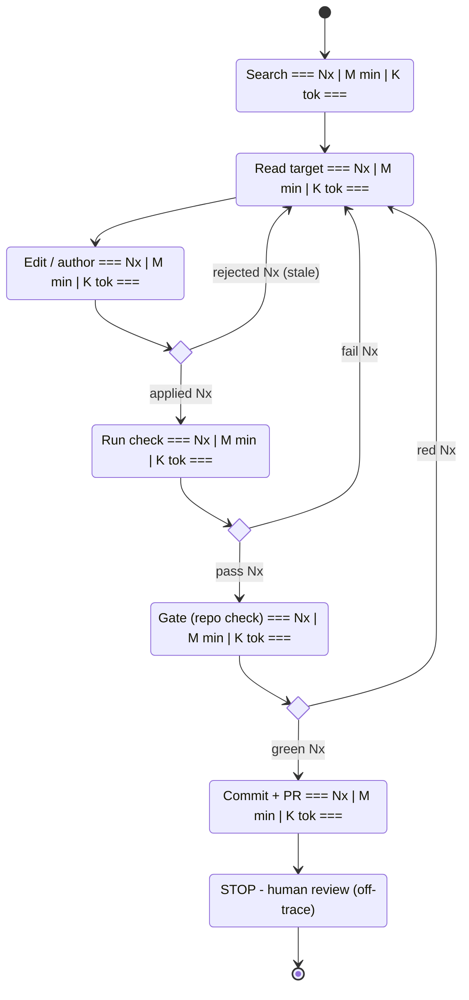

# Visualizing a developer's workflows with coach

Coach ingests Claude Code traces and logs into a **queryable database** and layers
**semantic structure** on top of the raw events — so you can ask both _what happened_
(the low-level tool calls) and _how the work flowed_ (interactions, intents, families,
causal edges), and analyse either. This skill drives that database to **aggregate a
developer's most common workflows into a single state machine** — one diagram per
recurring workflow family — with each state and transition decorated by the cost and
branch rates measured across all their sessions. **The rendered diagram is the
deliverable** (Mermaid → PNG for now; the technique is renderer-agnostic). Everything
before §6 — the families, the per-state cost, the branch rates — exists to produce the
labels on that diagram, not as a standalone report. Aim every query at "what goes on
the picture," then draw and render it.

## 0 — Get coach running as MCP (one-time, per machine)

If `/mcp` does not list `coach`, install it — see
**[INSTALL.md](https://github.com/ofekkir/coach/blob/main/INSTALL.md)** for the two
options: shell commands, or a copy-paste prompt that has Claude do the install for you.
Restart Claude Code afterwards and confirm with `/mcp`. Rendering needs `pnpm` and a
Chromium (system Chrome is fine).

## 1 — Load the developer's logs for the target project

```
load_dataset(repo: "<repo-name-or-abs-path>", includeWorktrees: true)
```

Loads the repo's Claude Code logs across the main checkout AND every git worktree.
Check the returned `sessions` / `interactions` / `nodes` counts are non-trivial,
then call `describe_schema` ONCE — the schema is the source of truth; trust it over
the column names below if they ever disagree. The queries below read the **typed
views** the schema exposes — `tools`, `llm_requests`, `interactions`,
`interaction_metrics` (each a documented projection of `nodes` by `type`) — instead of
filtering `nodes WHERE type=…` by hand; prefer them.

## 2 — Cluster interactions into workflow families (data-driven, not hardcoded)

One interaction → one family. This is the spine of the state machine. **Do not assume
the family taxonomy** — derive it from the `action` vocabulary that is actually in this
DB. `CHANGE / INVESTIGATE / OPS / DIRECT` is the _typical_ outcome on a coding repo, but
a different project may surface different actions, and inventing buckets the data can't
fill produces a fake diagram.

**2a — Learn the vocabulary.** See which actions exist and how common they are before
writing any CASE:

```sql
SELECT action, COUNT(*) AS calls, COUNT(DISTINCT interaction_id) AS interactions
FROM tools WHERE action IS NOT NULL    -- `tools` = the type='tool' slice of nodes (a schema view)
GROUP BY action ORDER BY calls DESC;
```

**2b — Fingerprint each interaction.** Reduce every interaction to the _set_ of actions
it used (plus a flag for no-tools), so it can be clustered:

```sql
SELECT n.id AS interaction_id,
  COALESCE(STRING_AGG(DISTINCT f.action, ',' ORDER BY f.action), '<none>') AS action_set
FROM interactions n
LEFT JOIN tools f ON f.interaction_id=n.id AND f.action IS NOT NULL
GROUP BY n.id;
```

**2c — Cluster with the LLM.** Group the distinct `action_set` fingerprints into a
small set of named families (aim for 3–6) by what the developer was _trying to do_, not
by tool mechanics. Always include an explicit **`OTHER`** bucket for fingerprints that
don't fit. Then express that clustering as a single CASE that maps each interaction to
exactly one family — the typical mapping (adapt the actions to whatever 2a returned):

```sql
-- f = per-interaction action flags from the BOOL_OR pattern over the actions in 2a
CASE WHEN f.interaction_id IS NULL          THEN 'DIRECT'        -- no tools: pure Q&A
     WHEN f.has_author OR f.has_edit        THEN 'CHANGE'        -- authored / edited code
     WHEN f.has_explore                     THEN 'INVESTIGATE'   -- explored, no writes
     WHEN f.has_vcs OR f.has_run            THEN 'OPS'           -- only ran / committed
     ELSE 'OTHER' END AS family
```

**2d — Roll up and SANITY-GATE before proceeding.** Count interactions / hours /
output-tokens per family:

```sql
SELECT family, COUNT(*) AS interactions,
       ROUND(100.0*COUNT(*)/SUM(COUNT(*)) OVER (),0) AS pct
FROM (/* the 2c classification */) g GROUP BY family ORDER BY interactions DESC;
```

Now **verify the numbers make sense, and STOP if they don't**:

- **`OTHER` is large** (say >20% of interactions) → the clustering missed real
  behaviour or the `action` column is under-populated. Do **not** draw. Inspect the
  `action_set` fingerprints landing in `OTHER`, refine 2c, and re-gate.
- **One family swallows ~everything** (e.g. 90% `DIRECT`, or 90% any single bucket) →
  this almost always means **ingestion is broken** — actions aren't being labelled, or
  only one session loaded. Do **not** proceed: report the distribution and the likely
  ingestion problem (re-check `load_dataset` counts from §1 and the §2a vocabulary),
  and ask before continuing.
- Numbers look plausible → draw a state machine only for families above ~5% of time.

## 3 — Cost per state and per transition

Each state is a tool bucket. Count and wall-clock come straight from tool nodes;
**tokens are attributed to the inference that EMITTED the call** via `causal_edges`,
deduped per (state, inference) so one turn's tokens are not multiplied across its
tools. Keep `Gate`/`Verify` before the generic `Run`, and `BashMutate` before `Run`.

```sql
WITH scope AS (  -- swap the filter to target one family (here: CHANGE)
  SELECT DISTINCT interaction_id FROM tools WHERE action IN ('author','edit')
),
tmap AS (
  SELECT t.id, t.duration_ms, ce.from_id AS inf,
    CASE
      WHEN t.name='Read' THEN 'Read'
      WHEN t.name IN ('Grep','Glob','LS') THEN 'Search'
      WHEN t.name='Write' THEN 'Author'
      WHEN t.name IN ('Edit','MultiEdit','NotebookEdit') THEN 'Edit'
      WHEN t.name='Bash' AND t.bash_command LIKE '%pnpm check%' THEN 'Gate'
      WHEN t.action IN ('test','verify') THEN 'Verify/Test'
      WHEN t.name='Bash' AND (t.bash_command LIKE '%rm %' OR t.bash_command LIKE '%sed %'
           OR t.bash_command LIKE '%perl %' OR t.bash_command LIKE '%git mv%') THEN 'BashMutate'
      WHEN t.action='vcs' THEN 'VCS'
      WHEN t.action='run' THEN 'Run'
      WHEN t.name LIKE 'mcp__%' OR t.action='mcp' THEN 'MCP'
      WHEN t.action='explore' THEN 'Search'
      ELSE 'other'
    END AS state
  FROM tools t LEFT JOIN causal_edges ce ON ce.to_id=t.id
  WHERE t.interaction_id IN (SELECT interaction_id FROM scope)
),
tok AS (
  SELECT state, SUM(tokens_out) AS out_tok FROM (
    SELECT DISTINCT m.state, m.inf, n.tokens_out
    FROM tmap m JOIN llm_requests n ON n.id=m.inf
  ) GROUP BY state
)
SELECT m.state, COUNT(*) AS times, ROUND(SUM(m.duration_ms)/60000.0,1) AS minutes,
       COALESCE(k.out_tok,0) AS output_tokens
FROM tmap m LEFT JOIN tok k ON k.state=m.state GROUP BY m.state, k.out_tok
ORDER BY minutes DESC;
```

For **transition cost** (the edges), measure each `state[seq] -> state[seq+1]`
adjacency within an interaction — count how often the transition is taken and the
wall-clock spent in the destination state. Adjacent steps share `interaction_id`
and order by `seq`; self-join on `seq+1` to weight each edge.

The `Gate` bucket is repo-specific (`pnpm check`). Adapt it to the target repo's
real gate (`make check`, `npm run ci`, `cargo test`, …) — find it from the most
common validation Bash commands before drawing.

## 4 — Branch frequencies for the decision points

The recovery edges are the most insightful labels. For each gating state, count
happy-path vs failure via `is_error`; these become edge labels like
`rejected 56x` / `applied 1510x`.

```sql
WITH t AS (SELECT * FROM tools
           WHERE interaction_id IN (SELECT DISTINCT interaction_id FROM tools
                                    WHERE action IN ('author','edit')))
SELECT
  COUNT(*) FILTER (WHERE name IN ('Edit','MultiEdit') AND is_error) AS edit_rejected,
  COUNT(*) FILTER (WHERE name IN ('Edit','MultiEdit') AND (is_error IS NULL OR NOT is_error)) AS edit_applied,
  COUNT(*) FILTER (WHERE action='run' AND is_error) AS run_fail,
  COUNT(*) FILTER (WHERE name='Bash' AND bash_command LIKE '%pnpm check%' AND is_error) AS gate_red,
  COUNT(*) FILTER (WHERE name='Bash' AND bash_command LIKE '%pnpm check%' AND (is_error IS NULL OR NOT is_error)) AS gate_green,
  COUNT(*) FILTER (WHERE action='vcs' AND is_error) AS vcs_fail
FROM t;
```

## 5 — Deviation-by-intent: how often work goes off the path

An interaction "deviates" if it has any tool error OR redundant calls (identical
`(name, tool_input)` ≥2× = wasted work). Report per `intent_category`.

```sql
WITH redundant AS (
  SELECT interaction_id FROM (
    SELECT interaction_id, name, tool_input, COUNT(*) c FROM tools
    GROUP BY interaction_id, name, tool_input HAVING COUNT(*) >= 2
  ) GROUP BY interaction_id
)
SELECT i.intent_category, COUNT(*) AS total,
  COUNT(*) FILTER (WHERE m.error_count>0 OR r.interaction_id IS NOT NULL) AS deviating,
  ROUND(100.0*COUNT(*) FILTER (WHERE m.error_count>0 OR r.interaction_id IS NOT NULL)/COUNT(*),0) AS pct,
  COUNT(*) FILTER (WHERE m.error_count>0) AS with_errors,
  COUNT(*) FILTER (WHERE r.interaction_id IS NOT NULL) AS with_redundancy
FROM interactions i JOIN interaction_metrics m ON m.interaction_id=i.id
LEFT JOIN redundant r ON r.interaction_id=i.id
GROUP BY i.intent_category ORDER BY deviating DESC;
```

State these caveats in the report: the columns overlap (union ≠ sum); an
`is_error` can be a legitimate probe (a test meant to fail), so this is an UPPER
bound — offer to tighten to `not_found`/`invalid_args` on Edit/Write + redundancy
for the "genuinely preventable" subset.

## 6 — Draw the state machine (Mermaid)

Write one `stateDiagram-v2` per non-trivial family. Decorate each measurable state
with `<br/>=== {times}x | {minutes} min | {tok}k tok ===`, and label each transition
with its frequency and cost (e.g. `rejected 56x`, `applied 1510x`). Leave
decision/thinking/human states blank but LABEL why (e.g. "judgment, no tool" /
"human, off-trace") so a blank never reads as a gap. Canonical CHANGE skeleton —
note mutating loops back-edge to **Read**, not Edit (a `sed`/`rm`/`git mv` or a
failed run invalidates the read-cache; re-read before re-editing):



## 7 — Render

```bash
node --experimental-strip-types scripts/render-mermaid.ts diagram.mmd out/diagram.png
```

The TypeScript helper auto-detects system Chrome for mermaid-cli's renderer. Open
the PNG (`open` on macOS, `xdg-open` on Linux) and deliver it with the analysis.

## Guardrails

- Numbers are tool-span wall-clock (excludes model thinking between calls) and
  EMITTING-inference output tokens (overlap across states; don't sum the token
  column to a workflow total). State both in the report.
- coach has zero `hook` nodes — deterministic PostToolUse hooks are invisible. A
  "build without verify" means no AGENT-issued check, not "no gate ran".
- Repo-specific buckets (`Gate`, test commands, file-type coverage for any
  hook-coverage split) MUST be adapted to the target repo before drawing.
