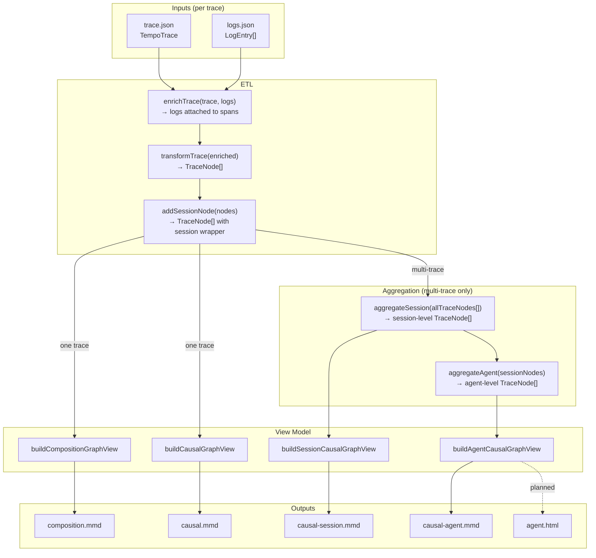

# coach

Improve agent harnesses — accuracy, latency, cost, and detection of hallucinations and operational
errors — through **OpenTelemetry (OTEL) trace analysis**. OTEL keeps coach **harness-agnostic**.

Unlike tracing built for engineers to observe agents, coach aims to reflect findings back to the
**agent itself**, with the engineer monitoring that loop. Stage one targets the engineer until we
learn which problems are solvable.

## Pipeline



| Output                   | Root node   | Structure                  |
| ------------------------ | ----------- | -------------------------- |
| `composition.mmd`        | flat list   | parent→child edges         |
| `causal.mmd`             | interaction | one thread per LLM source  |
| `causal-session.mmd`     | session     | one thread per interaction |
| `causal-agent.mmd`       | agent       | one thread per session     |
| `agent.html` _(planned)_ | agent       | same as above, interactive |

## Quick start

```bash
pnpm install
pnpm check     # typecheck + lint + format + test (same as CI)
```

## Development

| Command           | What it does                             |
| ----------------- | ---------------------------------------- |
| `pnpm check`      | Full gate: typecheck, lint, format, test |
| `pnpm lint:fix`   | Auto-fix lint issues                     |
| `pnpm format`     | Auto-format with Prettier                |
| `pnpm test:watch` | Vitest in watch mode                     |
| `pnpm build`      | Emit `dist/`                             |

Quality is enforced deterministically by committed hooks — a git `pre-commit` hook (Husky +
lint-staged), a Claude Code `PostToolUse` hook, and GitHub Actions CI. See `CLAUDE.md` for details.

## Contributing workflow

- Branch off `main`; **never commit to `main` directly**.
- Open a PR — CI runs on open, on every push to the branch, and on pushes to `main`.

### Recommended one-time setup (requires a GitHub remote)

Make CI a required check so PRs can't merge red:

```bash
gh api -X PUT repos/{owner}/{repo}/branches/main/protection \
  -F required_status_checks.strict=true \
  -F 'required_status_checks.contexts[]=check' \
  -F enforce_admins=true \
  -F required_pull_request_reviews.required_approving_review_count=1 \
  -F restrictions=
```
